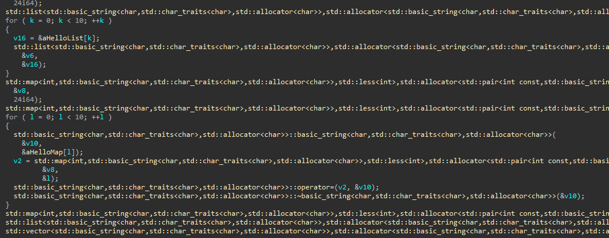

# About STL Comment
STL Comment is an IDA plugin that comments on STL calls.

# Installation
Just copy 'stl_comment.py' to the 'IDA\plugins' directory and restart IDA.

# Usage
## Press Ctrl+Alt+S in a function which calls STL functions.
## And Press F5 (to decompile)

### Before

### After

